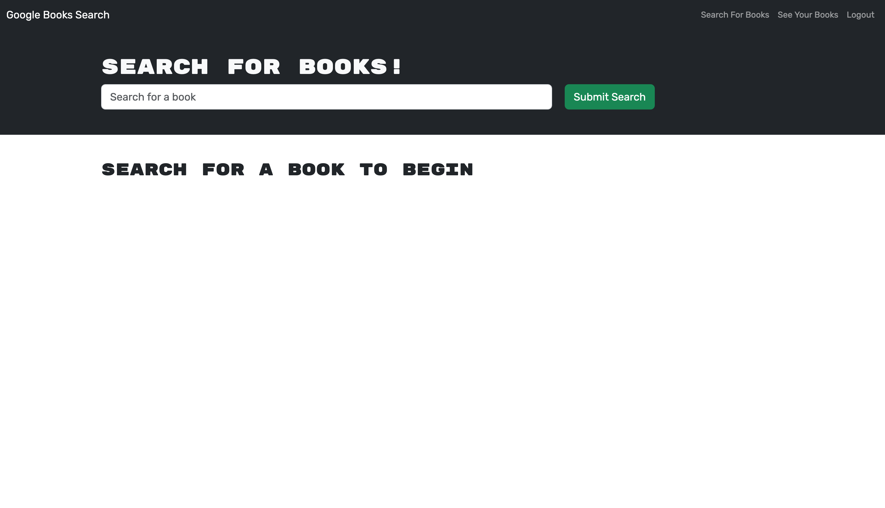

# Book Search Engine

This project is a full stack website that allows users to search books through the Google Books API and save them to a list. While starting code was provided, the task was to convert the project from a RESTful API to my own backend utilizing graphql.

While this project utilized a variety of frameworks like express, react, mongo, and apollo, the main focus of the project was incorporating graphql into the backend. It was interesting to see how Mutations and Typedefs worked in this project though the somne of the biggest challenges came from consistent naming as well as cors issues in the browser. Overall this project strengthened my knowledge connecting front and backend technologies as well as how to deploy on render.

*Some starting code provided by EdX*

## Usage

## Code Source
[Repository](https://github.com/alexismenendez/amenendez-book-search-engine)

## Resources & Assets
[Express](https://www.npmjs.com/package/express) 
[Mongoose](https://www.npmjs.com/package/mongoose) 
[MongoDB](https://www.mongodb.com/) 
[Nodemon](https://www.npmjs.com/package/nodemon) 
[Insomnia](https://insomnia.rest/) 
[Concurrently](https://www.npmjs.com/package/concurrently) 
[bcrypt](https://www.npmjs.com/package/bcrypt) 
[Apollo](https://www.npmjs.com/package/apollo) 
[graphql](https://www.npmjs.com/package/graphql) 
[React](https://www.npmjs.com/package/react) 
[Vite](https://www.npmjs.com/package/vite)
